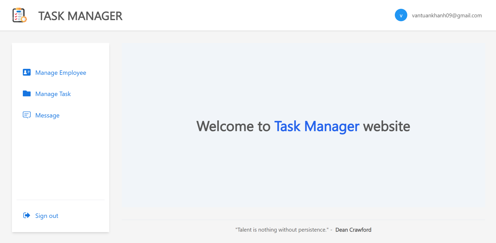

# Task Manager

This is an app using to manage employee and their assignment tasks. You should probably use the following command to configure the manager for your application

## Requirements

- [Nodejs](https://nodejs.org/en/download)
- [Firebase Account](https://firebase.google.com/docs)
- [Twilio Account](https://www.twilio.com/docs)
- [Mailtrap Account](https://mailtrap.io/)



## Installation

Clone the repository

```cmd
git clone https://github.com/vantuankhanh/task-management-extreme.git
cd task-management-extreme
```

### This project contains 2 sub-projects, a front-end and a backend

## Front End

Install the dependencies and run the front end

```cmd
cd front-end
yarn
```

Create the env file by renaming the .env.temp into .env
This .env contains all the URL we need to connect to the backend server

Now run the front end

```cmd
yarn start
```

### FrontEnd Folder Structure

```bash
├───public
└───src
    ├───assets
    ├───components ---> Common components
    ├───hooks ---> Custom hooks for the project
    ├───layout ---> Layout of the page
    ├───models ---> Interface of data getting from the backend
    ├───pages ---> Main page of the project
    ├───routes ---> Define all routes of the project
    ├───section ---> Define children of each page
    │   ├───auth
    │   │   └───login
    │   ├───employee
    │   ├───message
    │   └───tasks
    ├───services ---> API method for connecting to the backend
    ├───store ---> Contain reduxJS store
    │   └───reducer
    ├───style ---> CSS, SCSS styling
    │   └───layout
    └───utils ---> Common function using in the project
```

## Back End

Open another terminal in the root folder
Install the dependencies

```cmd
cd back-end
npm install
```

Create the env file by renaming the .env.temp into .env
Then replace the empty string of all row begin with the arrow to your properties of each service

Then start the back end

```cmd
npm start
```

### BackEnd Folder Structure

```bash
├───logs ---> Log the error occurred during running the project
├───public
│   └───stylesheets
└───src
    ├───connection ---> Establish the connection include: firebase, twilio, mailtrap
    ├───controllers
    │   ├───auth ---> Controll the authentication api
    │   ├───employee ---> Control the employee api
    │   ├───message ---> Control the message api
    │   └───task ---> Control the task api
    ├───loggers ---> Define function to log the error
    ├───middlewares ---> Verify token
    ├───routes ---> Define routes of app
    ├───utils ---> Common function
    └───views
└───index.js ---> Main application
```
